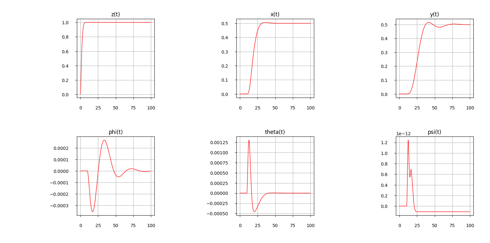
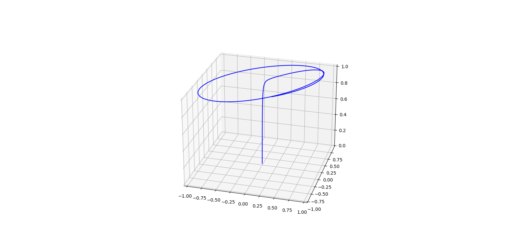

# Feedback-linearization-controller-for-quadcopter
**Controller design based on feedback linearization method and its implementation on quadcopter model.**  
This was used alongside other controllers to gain results published in [this paper](https://doi.org/10.26160/2474-5901-2024-43-42-54).  
   
`FBL_Controller.py` contains control law function that generates input signal for the model in the closed loop system.  
`dynamics.py` conteins dynamic model funtion (see Quadcopter-model [repository](https://github.com/Tindalus/Quadcopter-model)). In this case it outputs total angular velocity as well.  
`Model.py` central script simulating model's controlled behavior and containg controller parameters.  

## Setup  
**`FBL_Controller.py` takes 8 argument:**  
> State (list (12)): Current state of the system.  
> DesiredState (list (12)): List of desired trajectory coordinates.  
> Parameters (list (12)): List of controller paremeters.  
> Constants (list (15)): List of model characteristics: K, m, g, l, b, kftz, kftx, kfty, kfrz, kfrx, kfry, J_x, J_y, J_z, J_r.  
> Ts (float): Numerical scheme step.  
> T4 (float): Total angular velocity.  
> T (float): Total thrust.  
> DesiredAccelerations (list (6), optional): list of desired accelerations. Rarely used, default [0,0,0,0,0,0].
   
It returns a list of 6 input signals in order: [u1,u2,u3,tau_psi,tau_phi,tau_theta].
## Examples
User can specify desired trajectory using `DesiredState` variable in the `Model.py` like:  
```
#Make desired trajectory
DesiredState = np.zeros(shape=(12,1))
DesiredState[0,0] = 1 #desired trajectory is step function with modul of 1 along z coordinate
DesiredState[2,0] = 0.5 #desired trajectory is step function with modul of 0.5 along x coordinate
DesiredState[4,0] = 0.5 #desired trajectory is step function with modul of 0.5 along y coordinate
```
_It's better to let the drone lift 1m and than perform linear motion in xy plane. This can be done by setting up the condition in the main loop like:_
```
for i in range(N):

    #wait for drone to fly up 1m
    if i*Ts == 10:
        DesiredState[2,0] = 0.5 #desired trajectory is step function with modul of 0.5 along x coordinate
        DesiredState[4,0] = 0.5 #desired trajectory is step function with modul of 1 along y coordinate
    ...
```
this will generate movement like this:  
  

for more complex trajectories `DesiredState` variable shood be changed inside the main cycle:
```
for i in range(N):

    #make circular trajectory
    DesiredState[2,0] = np.sin(i*0.01) 
    DesiredState[4,0] = np.cos(i*0.01)
...
```
this will give following movement:  

